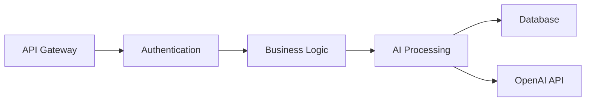
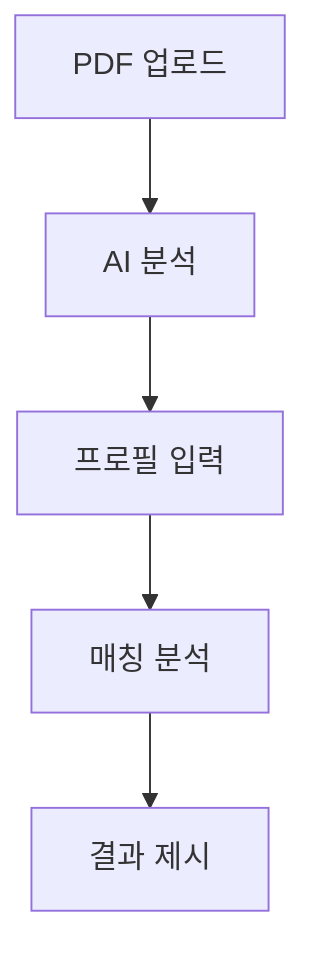

# 부동산 청약 분석 서비스 PRD

## (AI로 작성한 문서. 수정 필요)

## 🎯 제품 개요

### 제품 비전

> 부동산 청약 공고의 복잡한 정보를 AI가 자동으로 분석하여, 개인의 조건에 맞는 맞춤형 청약 가이드를 제공하는 서비스

### 해결하고자 하는 문제

- 📄 청약 공고의 복잡하고 방대한 정보로 인한 일반인의 이해 어려움
- 🤔 개인 조건에 맞는 청약 자격 판단의 복잡성
- 📊 최적의 청약 전략 수립의 어려움
- ⚠️ 청약 관련 실수로 인한 기회 손실

### 핵심 가치 제안

> **자동화된 분석** → PDF 공고문을 AI가 자동으로 파싱하고 분석  
> **개인 맞춤형 가이드** → 사용자 조건에 맞는 청약 자격 및 전략 제시  
> **당첨 확률 분석** → 각 공급 유형별 당첨 가능성 및 유리한 조건 안내

---

## 👥 타겟 사용자

### Primary 사용자

- **청약 초보자** 📚  
   청약 시스템을 처음 접하는 20-30대
- **바쁜 직장인** ⏰  
   청약 정보 분석에 시간을 투자하기 어려운 사용자
- **정확한 정보 필요자** 🎯  
   청약 실수를 방지하고 싶은 신중한 사용자

### Secondary 사용자

- **부동산 상담사** 🏢  
   고객 상담 시 보조 도구로 활용
- **청약 관련 커뮤니티 운영자** 💬  
   정확한 정보 제공을 위한 도구

---

## ⚡ 핵심 기능

### 1️⃣ PDF 분석 엔진

**기능 설명**  
OpenAI API를 활용한 청약 공고 PDF 자동 분석

**주요 기능**

- PDF 텍스트 추출 및 구조화
- 공급 유형별 자격 요건 파싱
- 일정, 가격, 면적 등 핵심 정보 추출
- 특별 공급 조건 및 우선순위 기준 분석

**기술 요구사항**

```
- PDF 파싱: PyPDF2, pdfplumber
- AI 분석: OpenAI GPT-4 API
- 데이터 저장: JSON/Database 구조화
```

### 2️⃣ 사용자 프로필 관리

**기능 설명**  
청약 자격 판단을 위한 개인 정보 수집 및 관리

**입력 정보**

- **기본 정보** 👤 나이, 거주지역, 세대주 여부
- **소득 정보** 💰 월 소득, 연 소득, 자산 보유 현황
- **주택 보유 현황** 🏠 무주택/유주택 여부, 보유 기간
- **청약 이력** 📋 청약통장 가입 기간, 납입횟수, 이전 당첨 이력
- **가족 구성** 👨‍👩‍👧‍👦 부양가족 수, 미성년 자녀 여부

**데이터 보안**

> ⚠️ 개인정보 암호화 저장  
> ⚠️ GDPR/개인정보보호법 준수  
> ⚠️ 사용자 동의 기반 데이터 수집

### 3️⃣ 자격 판정 엔진

**기능 설명**  
사용자 조건과 청약 공고 매칭을 통한 자격 판정

**판정 항목**

- **일반 공급 자격** ✅ 소득, 자산, 거주 요건 검증
- **특별 공급 자격** ✅ 신혼부부, 다자녀, 생애최초, 노부모부양 등
- **우선순위 계산** 📊 각 공급 유형별 순위 산정
- **제외 요건 검사** ❌ 재당첨 제한, 전매 제한 등

### 4️⃣ 분석 결과 제공

**기능 설명**  
분석 결과를 사용자 친화적으로 제시

**제공 정보**

- **지원 가능 여부** ✅/❌ 명확한 표시
- **지원 가능한 공급 유형** 📋 일반/특별 공급별 상세 안내
- **당첨 확률 분석** 📈 경쟁률 예측 및 유리한 조건 하이라이트
- **추천 전략** 💡 최적의 청약 전략 제시
- **주의사항** ⚠️ 놓치기 쉬운 조건이나 제한사항 알림

### 5️⃣ 알림 및 일정 관리

**기능 설명**  
청약 일정 및 중요 정보 알림

**알림 종류**

- 📅 청약 접수 시작/마감 알림
- 🎉 당첨자 발표일 알림
- 📝 계약 체결 일정 알림
- 🔔 관심 지역 신규 공고 알림

---

## 🏗️ 기술 아키텍처

### System Architecture



### 주요 기술 스택

- **Backend** 🔧 Python/FastAPI 또는 Node.js/Express
- **AI Processing** 🤖 OpenAI GPT-4 API
- **Database** 🗄️ PostgreSQL (구조화된 데이터) + Redis (캐싱)
- **PDF Processing** 📄 PyMuPDF, pdfplumber
- **Frontend** 🎨 React.js 또는 Vue.js
- **Authentication** 🔐 JWT 토큰 기반
- **Deployment** ☁️ Docker + AWS/GCP

### OpenAI API 활용 전략

```json
{
  "model": "gpt-4-turbo",
  "messages": [
    {
      "role": "system",
      "content": "부동산 청약 공고 분석 전문가로서 PDF 내용을 구조화하여 분석해주세요."
    },
    {
      "role": "user",
      "content": "다음 청약 공고에서 일반공급과 특별공급의 자격요건을 추출해주세요..."
    }
  ],
  "functions": [
    {
      "name": "extract_subscription_info",
      "description": "청약 정보를 구조화된 형태로 추출",
      "parameters": {
        "type": "object",
        "properties": {
          "general_supply": {...},
          "special_supply": {...},
          "schedule": {...}
        }
      }
    }
  ]
}
```

---

## 🔄 사용자 플로우

### 메인 플로우



1. **PDF 업로드** 📤 사용자가 청약 공고 PDF 업로드
2. **AI 분석** 🤖 OpenAI API를 통한 공고 내용 분석 및 구조화
3. **프로필 입력** 👤 사용자 개인 정보 및 자격 조건 입력
4. **매칭 분석** 🔍 개인 조건과 청약 요건 매칭
5. **결과 제시** 📊 자격 여부, 추천 전략, 당첨 확률 등 종합 분석 결과 제공

### 추가 플로우

- **공고 북마크** 🔖 관심 공고 저장 및 관리
- **비교 분석** ⚖️ 여러 공고 동시 비교
- **히스토리 관리** 📚 이전 분석 결과 조회

---

## 📊 성공 지표 (KPI)

### 사용자 지표

| 지표                      | 목표         | 기간     |
| ------------------------- | ------------ | -------- |
| 월간 활성 사용자 수 (MAU) | 10,000명     | 6개월 내 |
| PDF 분석 정확도           | 95% 이상     | -        |
| 사용자 만족도             | 4.5/5.0 이상 | -        |
| 재방문율                  | 60% 이상     | -        |

### 비즈니스 지표

| 지표           | 목표                   |
| -------------- | ---------------------- |
| 분석 완료율    | 90% 이상 (업로드 대비) |
| 평균 분석 시간 | 3분 이내               |
| 사용자 리텐션  | 30일 리텐션 40%        |

### 기술 지표

| 지표                   | 목표              |
| ---------------------- | ----------------- |
| API 응답 시간          | 평균 5초 이내     |
| 시스템 가용성          | 99.5% 이상        |
| OpenAI API 비용 효율성 | 분석당 $0.50 이하 |

---

## ⚠️ 제약사항 및 고려사항

### 기술적 제약사항

- **OpenAI API 비용** 💸 토큰 사용량에 따른 비용 증가
- **PDF 품질** 📄 스캔된 이미지 PDF의 경우 OCR 필요
- **법적 변경** 📋 청약 제도 변경 시 로직 업데이트 필요

### 법적 고려사항

- **개인정보보호** 🔒 민감한 금융 정보 처리
- **책임 한계** ⚖️ AI 분석 결과에 대한 법적 책임 범위 명시
- **정확성 고지** 📢 최종 판단은 사용자 책임임을 명확히 고지

### 비즈니스 리스크

- **정확성 이슈** ❌ 잘못된 분석으로 인한 사용자 손실
- **경쟁 서비스** 🏢 LH, SH 등 공공기관의 유사 서비스 출시 가능성
- **시장 규모** 📈 청약 시장의 계절성 및 규모 제한

---

## 🚀 개발 로드맵

### Phase 1: MVP (3개월)

> **목표**: 기본 기능 구현 및 서비스 론칭

- [ ] PDF 파싱 및 기본 분석 기능
- [ ] 사용자 프로필 관리
- [ ] 기본적인 자격 판정 로직
- [ ] 웹 인터페이스 구현

### Phase 2: 확장 (2개월)

> **목표**: 서비스 완성도 향상

- [ ] AI 분석 정확도 개선
- [ ] 당첨 확률 예측 모델
- [ ] 모바일 앱 개발
- [ ] 알림 기능 추가

### Phase 3: 고도화 (3개월)

> **목표**: 프리미엄 서비스 구축

- [ ] 다양한 공급 유형 지원 확대
- [ ] 개인화된 추천 알고리즘
- [ ] 커뮤니티 기능
- [ ] 프리미엄 서비스 모델

---

## 💰 수익 모델

### Freemium 모델

| 구분      | 무료           | 프리미엄                               |
| --------- | -------------- | -------------------------------------- |
| 분석 횟수 | 월 3회         | 무제한                                 |
| 기능      | 기본 자격 판정 | 상세 당첨 확률, 우선 알림, 전문가 상담 |

### B2B 서비스

- **부동산 중개업소** 🏢 API 제공
- **금융기관** 🏦 청약 상담 솔루션

---

## 🎯 성공 요소

### 핵심 성공 요소

- **분석 정확도** 🎯 OpenAI API 프롬프트 최적화를 통한 높은 정확도
- **사용자 경험** 🎨 복잡한 정보를 간단명료하게 제시
- **실시간성** ⚡ 최신 공고 정보의 신속한 반영
- **신뢰성** 🔒 일관되고 정확한 분석 결과 제공

### 차별화 포인트

> 🤖 **AI 기반 자동 분석**으로 인한 편의성  
> 👤 **개인 맞춤형 분석** 및 추천  
> 📚 **복잡한 청약 제도**의 간소화된 설명  
> 🔔 **실시간 공고 모니터링** 및 알림

---

## 📝 관련 문서

- [[OpenAI API 연동 가이드]]
- [[청약 제도 분석 문서]]
- [[사용자 인터뷰 결과]]
- [[경쟁사 분석 보고서]]

---

**Created**: `=date(today)`  
**Updated**: `=date(today)`  
**Tags**: #PRD #부동산 #청약 #AI #OpenAI
